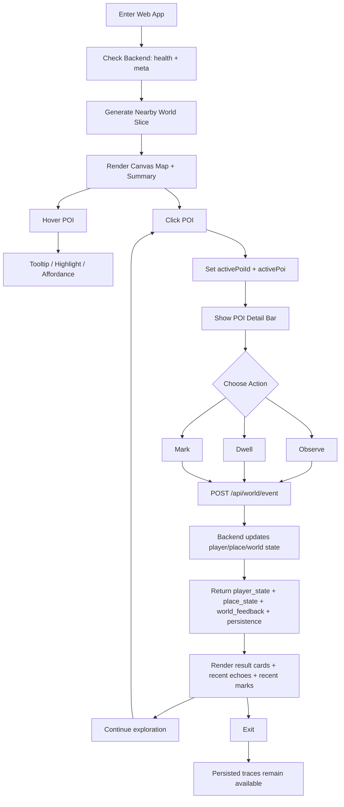

# Web MVP Interaction Loop for AI / Developer Reference

This document maps the current browser prototype to a concise interaction loop that AI agents, frontend developers, and backend developers can use as a shared implementation reference.

It is intentionally **logic-first** rather than presentation-first.

## 1. Scope

This flow describes the current React + FastAPI prototype centered on:

- generating a nearby world slice
- rendering a browser map view
- selecting a POI
- sending a minimal writeback event
- receiving structured world feedback
- continuing exploration with persistent state

Primary implementation anchors:

- `frontend/src/App.jsx`
- `frontend/src/WorldMap.jsx`
- `fablemap/web/service.py`
- `docs/WORLD_WRITEBACK_PROTOCOL.md`
- `docs/WORLD_WRITEBACK_PLAN.md`

## 2. Current system actors

### Player

A browser user who:

- opens the web entry
- generates a world slice
- explores the canvas map
- clicks a POI
- triggers `observe / dwell / mark`-style actions

### Frontend shell

The React UI is responsible for:

- checking backend availability
- requesting world generation
- rendering the map and detail panels
- tracking active POI selection
- packaging writeback events
- rendering returned player/place/world feedback

### Backend API

The FastAPI backend is responsible for:

- serving health/meta information
- generating nearby world slices
- accepting writeback events
- returning state deltas and persistence metadata

### World state layer

The world/persistence layer is responsible for:

- storing accepted events
- updating player state
- updating place state
- producing recent echoes, marks, and feedback hints

## 3. Canonical interaction loop

```text
[Enter web app]
  -> [Check backend health/meta]
  -> [Generate nearby world slice]
  -> [Render map + world summary]
  -> [Hover POI for affordance]
  -> [Click POI]
  -> [Set active POI + refresh detail bar]
  -> [Choose player action]
      -> observe
      -> dwell
      -> mark
  -> [POST /api/world/event]
  -> [Receive player_state + place_state + world_feedback + persistence]
  -> [Render echoes / marks / revealed fields / feedback]
  -> [Move to another POI and repeat]
  -> [Exit while persisted traces remain available]
```

## 4. Detailed flow by stage

### Stage 1 — Enter app

Entry point:

- `frontend/src/main.jsx` mounts the React application
- `frontend/src/App.jsx` owns the primary UI state

On load, the app initializes:

- API base URL
- world generation form
- writeback form
- active POI state
- backend status indicators

### Stage 2 — Check backend capability

The frontend calls:

- `GET /api/health`
- `GET /api/meta`

Purpose:

- verify backend reachability
- pull default coordinates and mode
- display current service status to the player

Output surfaced in UI:

- connection status
- frontend mode
- fixture availability
- output root

### Stage 3 — Generate nearby world slice

The frontend calls:

- `POST /api/nearby`

Input:

- `lat`
- `lon`
- `radius`
- `mode`
- `seed`
- optional `refresh`

Expected result payload includes:

- generated world object
- `preview_url`
- `world_id`
- primary POI / zone references used to seed later writeback defaults

Frontend state updates:

- `result`
- `activePoiId = null`
- `activePoi = null`
- writeback defaults such as `sliceId`, `targetId`, `zoneId`

### Stage 4 — Render map and exploration affordances

The map component receives:

- `world`
- `onPoiClick`
- `activePoiId`

Current affordances already present in the prototype:

- hover detection on POI hit area
- pointer cursor over interactive POIs
- tooltip with fantasy name and satire hook
- active selection glow
- click ripple animation
- palette changes based on region vibe
- secret-slot pulse ring for POIs with hidden potential

Interpretation for AI/developer use:

- **hover** = lightweight invitation to inspect
- **click** = commit focus to a specific place
- **ripple** = immediate confirmation that the world noticed the action
- **tooltip** = minimal narrative reward before deeper action

### Stage 5 — Select a POI

When a POI is clicked:

1. the map resolves hit detection
2. the map triggers a local ripple animation
3. the parent `onPoiClick` handler receives `poiId` and POI data
4. the frontend stores:
   - `activePoiId`
   - `activePoi`
5. the writeback form is synchronized so the selected POI becomes the current target

Visible result:

- selected POI remains highlighted
- detail bar shows fantasy name, type, satire hook, emotion hook
- quick action button becomes contextual to the selected place

### Stage 6 — Choose player action

Current action model is aligned to the minimal writeback protocol:

- `observe`
- `dwell`
- `mark`

Current UI status:

- the compact POI detail bar exposes a quick action button
- the admin/debug panel exposes full writeback form controls

Recommended semantic interpretation for the current MVP:

| Action | Player meaning | Immediate system expectation |
| --- | --- | --- |
| `observe` | inspect the place closely | reveal fields, raise attunement, append observation echo |
| `dwell` | remain with the place for a moment | raise familiarity, possibly add local echo |
| `mark` | leave a private emotional trace | add place mark, strengthen memory ownership |

### Stage 7 — Submit writeback event

Frontend action:

- `POST /api/world/event`

Event envelope contains four layers:

1. event identity
2. target
3. payload
4. source/context

Canonical structure in the current frontend:

```json
{
  "event_type": "observe | dwell | mark",
  "player_id": "player_local",
  "visibility": "private",
  "target": {
    "target_type": "poi | zone",
    "target_id": "...",
    "slice_id": "..."
  },
  "payload": {
    "...": "depends on event_type"
  },
  "source": {
    "client": "web",
    "surface": "react_writeback_panel",
    "version": "v0.1"
  },
  "context": {
    "current_zone_id": "...",
    "nearest_poi_id": "..."
  }
}
```

Payload variants in the current frontend:

- `observe` -> `intensity`, optional `note`
- `mark` -> `tag`, optional `note`
- `dwell` -> `zone_id`, optional `note`

### Stage 8 — World feedback returned by backend

The current UI expects the response to contain at least:

- `player_state`
- `place_state`
- `world_feedback`
- `persistence`

The frontend already renders the following categories:

#### Player state

Examples:

- `action_state`
- `clarity`
- `tension`
- `attunement`
- `zone_familiarity`
- `poi_familiarity`

#### Place state

Examples:

- `target_id`
- `target_type`
- `familiarity`
- `mark_count`
- `last_event_type`

#### World feedback

Examples:

- `broadcast_hints`
- `revealed_fields`
- `echo_entries`
- UI-facing response text or structured hints

#### Persistence metadata

Examples:

- stored event count
- persistence/state file path

#### Recent derived lists

Already surfaced by the frontend:

- `recent_echoes`
- `marks`

### Stage 9 — Loop exploration

After one action, the player can:

- stay on the same POI and try another action
- click another POI
- regenerate the nearby slice
- inspect feedback cards and echoes
- continue building familiarity and marks over time

This is the current MVP loop:

```text
select place -> act -> receive response -> inspect traces -> continue exploring
```

### Stage 10 — Exit and persistence

The player may leave the page at any time.

Design assumption already reflected in the protocol documents:

- accepted actions should survive beyond a single click
- traces can later reappear as echoes, marks, familiarity, or home-related updates
- persistence makes the world feel responsive rather than disposable

## 5. AI-readable state transition model

```text
STATE: idle
  on app_load -> checking_backend

STATE: checking_backend
  on health_ok + meta_ok -> ready_for_generation
  on failure -> backend_unavailable

STATE: ready_for_generation
  on submit_nearby -> generating_world

STATE: generating_world
  on nearby_success -> world_loaded
  on nearby_failure -> generation_error

STATE: world_loaded
  on hover_poi -> world_loaded_with_affordance
  on click_poi -> poi_selected

STATE: poi_selected
  on submit_observe -> writeback_pending
  on submit_dwell -> writeback_pending
  on submit_mark -> writeback_pending
  on click_other_poi -> poi_selected

STATE: writeback_pending
  on writeback_success -> feedback_rendered
  on writeback_failure -> writeback_error

STATE: feedback_rendered
  on click_poi -> poi_selected
  on submit_nearby_refresh -> generating_world
  on exit -> persisted_session_end
```

## 6. Current UI-to-system mapping

| UI surface | Current role | System meaning |
| --- | --- | --- |
| service status card | backend reachability | world entry readiness |
| generation form | choose slice origin | world slice request |
| canvas map | primary exploration surface | spatial interaction layer |
| tooltip | hover affordance | low-cost narrative hint |
| active POI detail bar | immediate place context | selected interaction target |
| quick action button | short path to participation | minimum player agency |
| admin writeback panel | explicit protocol testing | full event authoring/debug surface |
| result cards | structured response viewer | state transition inspection |
| recent echoes / marks | visible aftermath | proof that actions leave traces |

## 7. Gaps between current prototype and desired “gentle exploration” loop

The current prototype already contains the mechanical spine, but some “gentle” interaction goals are only partially represented.

### Already present

- hover affordance
- click confirmation ripple
- active place focus
- structured writeback actions
- recent echoes and marks
- player/place feedback panels

### Partially present

- onboarding hints for first-time exploration
- softer narrative phrasing instead of debug-heavy labels
- stronger reward messaging for pause/observation
- clearer distinction between `observe`, `dwell`, and `mark` in the main player-facing UI

### Not yet primary in the player-facing path

- mirrored home updates surfaced as a warm reward loop
- lightweight surprise prompts that guide players toward hidden POIs
- first-class narrative microfeedback after every action in the main, non-admin surface
- explicit “linger here for meaning” timing-based feedback

## 8. Recommended next implementation order

1. Add a player-facing hint layer on top of the canvas and POI detail bar.
2. Split the quick action area into three explicit actions: `observe`, `dwell`, `mark`.
3. Transform writeback response summaries into softer narrative microfeedback for the main surface.
4. Surface `broadcast_hints`, `echo_entries`, and future `home_updates` directly beside the selected POI flow.
5. Preserve the admin/debug panel as a lower-level protocol inspector, not the primary interaction path.

## 9. Mermaid flowchart



## 10. File anchors for implementation

Frontend:

- `frontend/src/App.jsx` — app state, nearby generation, POI selection, writeback event submission, feedback rendering
- `frontend/src/WorldMap.jsx` — canvas rendering, hover detection, click detection, ripple feedback, tooltip affordance

Backend / protocol:

- `docs/WORLD_WRITEBACK_PROTOCOL.md` — canonical event vocabulary and expected effects
- `docs/WORLD_WRITEBACK_PLAN.md` — implementation sequencing for writeback
- `fablemap/web/service.py` — likely backend service integration point for nearby generation and writeback handling

## 11. Short version for AI agents

If an AI agent needs the shortest usable summary, use this:

```text
Current FableMap Web MVP loop:
1. App boot checks backend health/meta.
2. Player generates a nearby world slice.
3. Canvas map renders roads and POIs.
4. Hover shows affordance; click selects a POI.
5. Selection syncs the writeback target.
6. Player triggers observe/dwell/mark.
7. Frontend sends POST /api/world/event.
8. Backend returns player_state, place_state, world_feedback, persistence.
9. UI shows traces such as echoes, marks, and revealed fields.
10. Player continues exploration with accumulating state.
```
