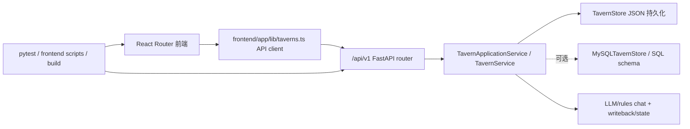

## 问题与范围

用户关心：当前 FableMap 是否只是“模型能力带来的开发幻觉”，实际只是只能本地打开的静态网页。

本次只做证据化探索，不改业务代码。范围聚焦：

- 主链路是否有后端/API/持久化支撑；
- 前端是否真的调用 API，还是只渲染静态假数据；
- 是否有自动化验证；
- 当前距离真实产品化还缺什么。

## 速答

结论：**FableMap 不是纯静态网页，也不是只有本地 HTML 的 demo**。仓库已有 FastAPI v1 后端、Tavern/Chat/Gameplay 等 API、JSON 文件持久化、MySQL schema/实现雏形、React Router 前端 API client、Docker Compose、后端和前端测试。本轮还用全新数据目录跑通了“健康检查 → 默认酒馆 seed → 创建酒馆 → 添加 NPC → 访客进入 → 发送聊天 → 历史读取 → 跨访客权限拒绝”的后端主链路烟测。

但它也**还不是生产级产品**。更准确定位是：**本地优先、功能较多、已有工程骨架的产品原型**。最大风险不是“没有工程”，而是功能/任务膨胀快于真实用户链路、部署运维、权限认证和数据迁移验证，容易继续滑向“什么都有但没有一条链路被打磨稳”的 AI 开发幻觉。

## 关键证据

1. `README.md:47-60` 声称仓库已有最小闭环：后端、地图/酒馆、聊天、写回、玩法、默认公益酒馆；这不是单页静态展示的描述。
2. `backend/src/fablemap_api/main.py:46-74` 创建真实 FastAPI app，注入 `TavernApplicationService`，挂载 `/api/v1` router，并选择 JSON/MySQL 存储。
3. `backend/src/fablemap_api/api/v1/router.py:11-37` 注册 health、taverns、characters、chat、gameplay、state_cards、owners、rumors、homes 等 API 模块。
4. `backend/src/fablemap_api/core/tavern.py:673-900` 实现 JSON `TavernStore`，包含 `taverns.json`、`taverns_keyvault.json`、默认公益酒馆 seed、CRUD、删除时清理聊天记录。
5. `backend/sql/migrations/001_initial_schema.sql:18-201` 定义 MySQL 表：`taverns`、`characters`、`world_info`、`visitors`、`chat_messages`、`memory_atoms`、`gameplay_sessions`、`llm_configs`。
6. `frontend/app/lib/taverns.ts:715-760`、`944-1020`、`1585-1645` 前端通过 `/api/v1/taverns`、`/chat`、`/gameplays`、`/gameplay-sessions` 调后端，不是完全写死数据。
7. `docker-compose.yml:1-44` 提供 backend + frontend 两服务，backend 有 healthcheck，frontend 依赖 backend healthy。
8. 本轮验证结果：
   - `& 'C:\Users\phpxi\miniconda3\python.exe' -m compileall -q backend/src`：通过。
   - `& 'C:\Users\phpxi\miniconda3\python.exe' -m pytest -q --tb=short tests/test_tavern_gameplay_api.py tests/test_tavern_chat_history_permissions.py`：`4 passed`。
   - `npm --prefix .\frontend test`：全部前端脚本测试通过。
   - `npm --prefix .\frontend run build`：React Router/Vite 构建通过。
   - `artifacts/runlogs/reality-audit-20260430-smoke` 数据目录烟测：创建酒馆、加 NPC、进入、聊天、按角色读取 2 条历史、跨访客读取返回 403。

## 细节展开

### 已经不是“静态网页”的部分

- 有后端应用入口、路由、服务层、领域对象和持久化文件。
- 前端 route loader 和组件通过 `frontend/app/lib/taverns.ts` 调 API。
- 聊天链路会写入 `chat_history/<tavern>/<visitor>_<character>.jsonl`。
- LLM 配置有 keyvault 分离，`rules` 后端可无外部 API Key 运行本地闭环。
- GameplayDefinition / GameplaySession 有后端模型、API 与测试。
- 默认公益酒馆 seed 让全新数据目录也能启动后有可发现内容。

### 仍然原型化 / 幻觉风险高的部分

- 当前工作区有大量未提交变更与大量 active task，功能面扩张过快。
- 默认身份仍大量使用 `owner-demo` / `visitor-demo`，缺少真正账号/会话/鉴权体系。
- 默认持久化是 JSON 文件；MySQL 有 schema 和 store，但不等于已经完成生产迁移、备份、并发与运维验证。
- 很多功能以 `preview`、`presentational`、`MVP` 形式存在，真实使用链路和异常恢复未必完整。
- 前端 build 为 SPA mode，可以部署静态前端，但“能构建”不等于“在线产品可运营”。
- 当前需要人工严格控制 backlog，否则很容易出现 UI/任务越来越多、主链路质量没有同步提高。

## 未决问题

- 是否已经有一次从空数据目录、真实浏览器、非 TestClient 的端到端人工验收记录？
- Docker Compose 当前是否在目标机器上实际 `up --build` 过，并验证前端代理 `/api`？
- MySQL store 是否已覆盖全部 JSON store 行为，尤其是新增的 StateCard、Home、Rumor、VisitorNote 等私有桶？
- 真实多用户身份、owner 权限、API Key 存储和日志脱敏是否有统一威胁模型？
- 主链路之外的 preview/presentational 功能，哪些应该冻结、删除或降级为 backlog？

## 后续建议

暂停新功能，做一轮“主链路收敛”：只验收 **创建酒馆 → 配置 NPC/LLM → 访客进入 → 聊天 → 写回/状态 → 回访**，把其余功能按“已闭环 / 半闭环 / 纯展示 / 应冻结”分组。

## 相关文档

- `README.md`
- `docs/ARCHITECTURE.md`
- `docs/WORLD_SCHEMA.md`
- `docs/WHAT_NOT_TO_BUILD.md`
- `docker-compose.yml`
- `frontend/app/lib/taverns.ts`
- `backend/src/fablemap_api/main.py`
- `backend/src/fablemap_api/core/tavern.py`
- `backend/src/fablemap_api/application/services/runtime.py`
- `backend/src/fablemap_api/application/services/gameplay.py`
